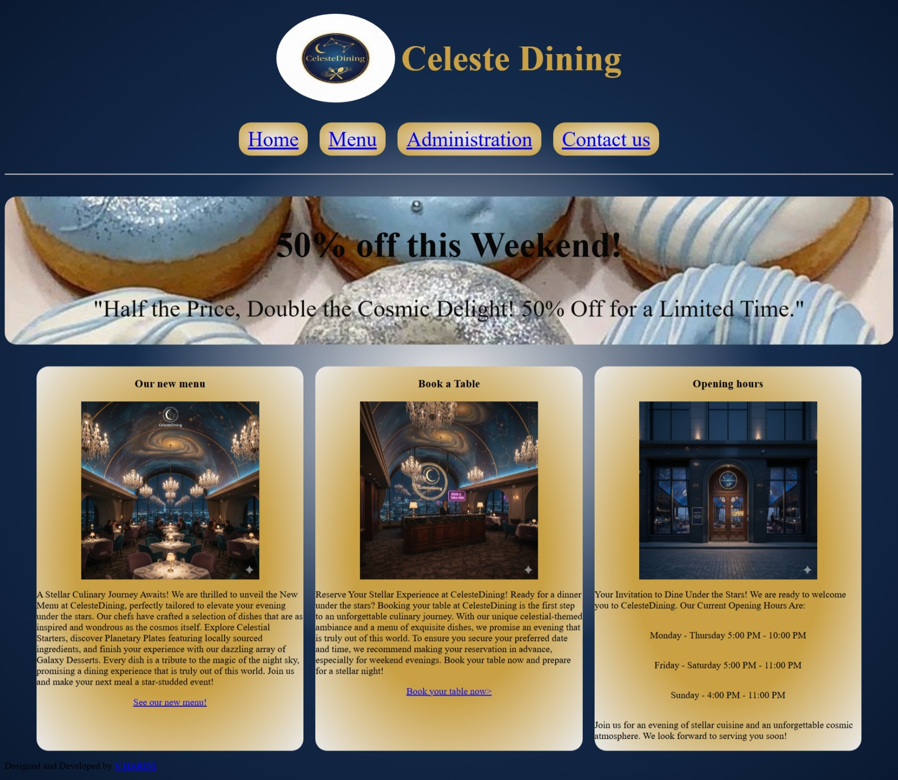
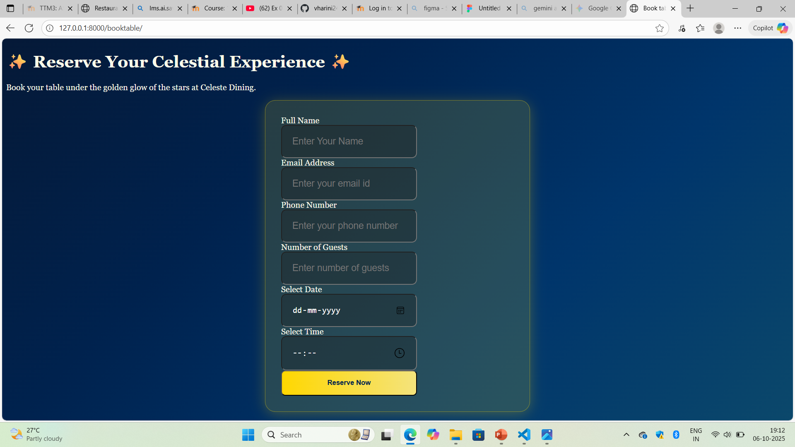
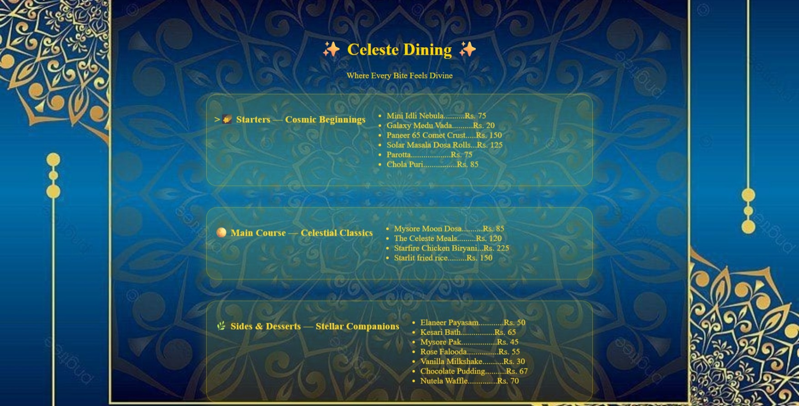
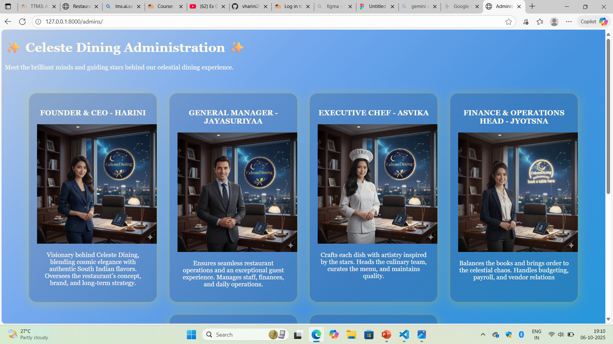
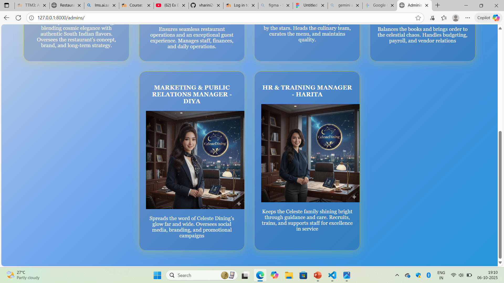
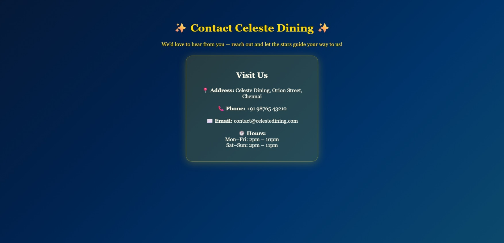

# Ex.07 Restaurant Website
# Date: 6/10/2025
# AIM:
To develop a static Restaurant website to display the food items and services provided by them.

# DESIGN STEPS:
## Step 1:
Requirement collection.

## Step 2:
Creating the layout using HTML and CSS.

## Step 3:
Updating the sample content.

## Step 4:
Choose the appropriate style and color scheme.

## Step 5:
Validate the layout in various browsers.

## Step 6:
Validate the HTML code.

## Step 7:
Publish the website in the given URL.

# PROGRAM:
```
index.html


<!DOCTYPE html>
<html lang="en">
<head>
    <meta charset="UTF-8">
    <meta name="viewport" content="width=device-width, initial-scale=1.0">
    <title>Restaurant</title>
    <style>
        body{
            background: radial-gradient(#EAEAEA,#152C4D,#0A1931);
        }
        .header{
            display: flex;
            flex-direction: column;
            justify-content: space-between; 
            align-items: center;
            padding: 15px 30px;
            border-bottom: 2px solid #ddd
        }


        .logo{
            display: flex;
            align-items: center;
            gap: 10px;
            
        }
        .logo h1{
            color:#C9A043;
            font-size: 60px;
        }

        .logo img{
            width: 200px;
            border-radius: 50%;
        }

        .links{
            display: flex;
            gap: 20px;
            font-size: 35px;
            justify-content: center;
            margin: auto;
            width: auto;
            padding: 15px 0;
            

        }

        .links a{
            background: radial-gradient( #EAEAEA,#C9A043 );
            padding: 8px 15px;
            border-radius: 20px;
            
            

        }
        .cards{
            display: flex;
            flex-direction: row;
            gap: 20px;
            justify-content: center;


        }
        .card{
            display: flex;
            flex-direction: column;
            background: radial-gradient(#C9A043, #C9A043,#EAEAEA)  ;
            height: auto;
            width: 450px;
            border-radius: 20px;
            align-items: center;
            align-items: justify;
            box-shadow:#EAEAEA;
        }
        .offer{
            background: url("") center/cover no-repeat;
            display: flex;
            flex-direction: column;
            justify-content: center;
            align-items: center;
            height: 250px;
            text-align: center;
            position: relative;
            border-radius: 20px;
            
        }
        .offer h2{
            font-size: 60px;
            color: #070707;
        }
        .offer p{
            font-size: 40px;
            color: #0e0d0d;
        }


    </style>
</head>
<body>
    <div class="header">
        <div class="logo">
            
            <h1>Celeste Dining</h1>
        </div>
        <br>
        <div class="links">
            <a href="">Home</a>
            <a href="">Menu</a>
            <a href="">Administration</a>
            <a href="">Contact us</a>
        </div>
    </div>
    <br>
    <br>

    <div class="offer">
        <div class="offer-text">
            <h2>50% off this Weekend!</h2>
            <p>"Half the Price, Double the Cosmic Delight! 50% Off for a Limited Time."</p>
        </div>
    </div>
    <br>
    <br>

    <div class="cards">
        <div class="card">
            <h3>Our new menu</h3>
            
            <p>A Stellar Culinary Journey Awaits!
We are thrilled to unveil the New Menu at CelesteDining, perfectly tailored to elevate your evening under the stars.

Our chefs have crafted a selection of dishes that are as inspired and wondrous as the cosmos itself. Explore Celestial Starters, discover Planetary Plates featuring locally sourced ingredients, and finish your experience with our dazzling array of Galaxy Desserts.

Every dish is a tribute to the magic of the night sky, promising a dining experience that is truly out of this world.

Join us and make your next meal a star-studded event!

</p>
            <a href="">See our new menu!</a>
        </div>
        <div class="card">
            <h3>Book a Table</h3>
            
            <p>Reserve Your Stellar Experience at CelesteDining!
Ready for a dinner under the stars?

Booking your table at CelesteDining is the first step to an unforgettable culinary journey. With our unique celestial-themed ambiance and a menu of exquisite dishes, we promise an evening that is truly out of this world.

To ensure you secure your preferred date and time, we recommend making your reservation in advance, especially for weekend evenings.

Book your table now and prepare for a stellar night!

</p>
            <a href="">Book your table now></a>
        </div>
        <div class="card">
            <h3>Opening hours</h3>
            
            <p>Your Invitation to Dine Under the Stars!
We are ready to welcome you to CelesteDining.

Our Current Opening Hours Are:</p>

<p>Monday - Thursday	5:00 PM - 10:00 PM</p>
<p>Friday - Saturday	5:00 PM - 11:00 PM</p>
<p>Sunday - 4:00 PM - 11:00 PM</p>

<p>Join us for an evening of stellar cuisine and an unforgettable cosmic atmosphere.

We look forward to serving you soon!</p>

            

        </div>
    </div>
    <div class="last">
        <p>Designed and Developed by <a href="#">V HARINI</a></p>

    </div>
    
</body>
</html>

booktable.html

<!DOCTYPE html>
<html lang="en">
<head>
    <meta charset="UTF-8">
    <meta name="viewport" content="width=device-width, initial-scale=1.0">
    <title>Book table</title>
    <style>
        body{
            background: linear-gradient(135deg, #051937, #00224e, #00356b, #0b486b);
            background-attachment: fixed;
            font-family: 'Georgia', serif;
            color: #fffbea;
        }
        .header{
            text-align: center;
            padding: 50px 20px 20px;
            color: #fad91f;

        }
        .container{
            display: flex;
            justify-content: center;
            align-items: center;
        }
        .card{
            display: flex;
            background: rgba(253, 230, 28, 0.15);
            border: 1px solid rgba(255, 215, 0, 0.4);
            border-radius: 20px;
            box-shadow: 0 4px 25px rgba(255, 215, 0, 0.25);
            padding: 30px;
            width: 450px;
            text-align: left;

        }
        form{
            display: flex;
            flex-direction: column;
        }
        input{
            border-radius: 10px;
            padding: 20px;
            font-size: large;
            background: rgba(23, 22, 22,0.3);
            color: #fff;
        }
        button{
            padding: 15px;
            border-radius: 8px;
            background: linear-gradient(90deg, #ffd700, #f4e37c);
            color: #00224e;
            font-weight: bold;
        }

    </style>
</head>
<body>
    <header class="book-header">
        <h1>✨ Reserve Your Celestial Experience ✨</h1>
        <p>Book your table under the golden glow of the stars at Celeste Dining.</p>
    </header>

    <div class="container">
        <div class="card">
            <form>
                <label for="name">Full Name</label>
                <input type="text" id="name" placeholder="Enter Your Name" required>

                <label for="email">Email Address</label>
                <input type="email" id="email" placeholder="Enter your email id" required>

                <label for="phone">Phone Number</label>
                <input type="tel" id="phone" placeholder="Enter your phone number" required>

                <label for="guests">Number of Guests</label>
                <input type="number" id="guests" placeholder="Enter number of guests" required>

                <label for="date">Select Date</label>
                <input type="date" id="date" placeholder="Enter Date" required>

                <label for="time">Select Time</label>
                <input type="time" id="time" placeholder="Enter Time" required>

                <button type="submit">Reserve Now</button>
            </form>

        </div>
    </div>

</body>
</html>

menu.html


<!DOCTYPE html>
<html lang="en">
<head>
    <meta charset="UTF-8">
    <meta name="viewport" content="width=device-width, initial-scale=1.0">
    <title>menu</title>
    <style>
        body{
            background: url("") center/cover fixed no-repeat;
            background-attachment: fixed;
            
        }
        .container{
            display: flex;
            justify-content: left;
            gap: 40px;
            flex-wrap: wrap;
            flex-direction: column;
            margin: auto;
            align-items: start;
            
        }
        .category{
            display: flex;
            flex-wrap: wrap;
            background: rgba(252, 248, 29, 0.15);
            border: 1px solid rgba(255, 215, 0, 0.4);
            backdrop-filter: blur(10px); 
            box-shadow: 0 4px 25px rgba(255, 215, 0, 0.25);
            color: #fed72c; 
            border-radius: 20px;
            padding: 15px;
            box-shadow: #EAEAEA;
            margin: auto;
            justify-items: left;
            width: 700px;
        
        }
        .header{
            text-align: center;
            padding: 40px 20px 10px;
            color: #ffd700;
        }
    </style>
</head>
<body>
    <header class="header">
        <h1>✨ Celeste Dining ✨</h1>
        <p>Where Every Bite Feels Divine</p>
    </header>

    <div class="container">
        <div class="category">
            <h3>>🌠 Starters — Cosmic Beginnings</h3>
            <ul>
                <li>Mini Idli Nebula..........Rs. 75</li>
                <li>Galaxy Medu Vada..........Rs. 20</li>
                <li>Paneer 65 Comet Crust.....Rs. 150</li>
                <li>Solar Masala Dosa Rolls...Rs. 125</li>
                <li>Parotta...................Rs. 75</li>
                <li>Chola Puri................Rs. 85</li>
            </ul>
        </div>
        <div class="category">
            <h3>🌕 Main Course — Celestial Classics</h3>
            <ul>
                <li>Mysore Moon Dosa..........Rs. 85</li>
                <li>The Celeste Meals.........Rs. 120</li>
                <li>Starfire Chicken Biryani...Rs. 225</li>
                <li>Starlit fried rice.........Rs. 150</li>
            </ul>
        </div>
        <div class="category">
            <h3>🌿 Sides & Desserts — Stellar Companions</h3>
            <ul>
                <li>Elaneer Payasam............Rs. 50</li>
                <li>Kesari Bath................Rs. 65</li>
                <li>Mysore Pak.................Rs. 45</li>
                <li>Rose Falooda...............Rs. 55</li>
                <li>Vanilla Milkshake..........Rs. 30</li>
                <li>Chocolate Pudding..........Rs. 67</li>
                <li>Nutela Waffle..............Rs. 70</li>
            </ul>
        </div>
    </div>
</body>
</html>

admin.html


<!DOCTYPE html>
<html lang="en">
<head>
    <meta charset="UTF-8">
    <meta name="viewport" content="width=device-width, initial-scale=1.0">
    <title>Administration</title>
    <style>
        body{
            background: linear-gradient(135deg, #b9cce7, #75a9ee, #4692de, #2798da);
            background-attachment: fixed;
            font-family: 'Georgia', serif;
            color: #fffbea;
        }
        .container{
            display: flex;
            flex-wrap: wrap;
            justify-content: center;
            gap: 30px;
            padding: 40px;
        }
        .cards{
            background: rgba(3, 13, 31, 0.15);
            border-radius: 20px;
            box-shadow: 0 4px 25px rgba(255, 215, 0, 0.25);
            text-align: center;
            width: 280px;
            padding: 20px;
            color: #fffbea;
            border: 1px solid rgba(255, 215, 0, 0.4);


        }
        .header{
            text-align: center;
            padding: 50px 20px 30px;
            color: #ffd700;
        }

    </style>
</head>
<body>
    <header class="admin-header">
    <h1>✨ Celeste Dining Administration ✨</h1>
    <p>Meet the brilliant minds and guiding stars behind our celestial dining experience.</p>
    </header>

    <div class="container">
        <div class="cards">
            <h3>FOUNDER & CEO - HARINI</h3>
            
            <p>Visionary behind Celeste Dining, blending cosmic elegance with authentic South Indian flavors.
Oversees the restaurant’s concept, brand, and long-term strategy.</p>
        </div>
        <div class="cards">
            <h3>GENERAL MANAGER - JAYASURIYAA</h3>
            
            <p>Ensures seamless restaurant operations and an exceptional guest experience.
Manages staff, finances, and daily operations.</p>
        </div>
        <div class="cards">
            <h3>EXECUTIVE CHEF - ASVIKA</h3>
            
            <p>Crafts each dish with artistry inspired by the stars.
Heads the culinary team, curates the menu, and maintains quality.</p>
        </div>
        <div class="cards">
            <h3>FINANCE & OPERATIONS HEAD - JYOTSNA</h3>
            
            <p>Balances the books and brings order to the celestial chaos.
Handles budgeting, payroll, and vendor relations</p>
        </div>
        <div class="cards">
            <h3>MARKETING & PUBLIC RELATIONS MANAGER - DIYA</h3>
            
            <p>Spreads the word of Celeste Dining’s glow far and wide.
Oversees social media, branding, and promotional campaigns</p>
        </div>
        <div class="cards">
            <h3>HR & TRAINING MANAGER - HARITA</h3>
            
            <p>Keeps the Celeste family shining bright through guidance and care.
Recruits, trains, and supports staff for excellence in service</p>
        </div>

    
</body>
</html>

contact.html

<!DOCTYPE html>
<html lang="en">
<head>
    <meta charset="UTF-8">
    <meta name="viewport" content="width=device-width, initial-scale=1.0">
    <title>Contact</title>
    <style>
        body{
            background: linear-gradient(135deg, #051937, #00224e, #00356b, #0b486b);
            background-attachment: fixed;
            font-family: 'Georgia', serif;
            color: #fffbea;
            margin: 0;
            padding: 0;
        }
        .header{
            text-align: center;
            padding: 40px 20px 10px;
            color: #ffd700;
        }
        .info{
            background: rgba(255, 215, 0, 0.15);
            border: 1px solid rgba(255, 215, 0, 0.4);
            border-radius: 20px;
            backdrop-filter: blur(10px);
            box-shadow: 0 4px 25px rgba(255, 215, 0, 0.25);
            padding: 25px;
            width: 350px;
            color: #fffbea;
            align-items: center;
            justify-content: center;
            text-align: center;

        }
        .container{
            align-items: center;
            display: flex;
            justify-content: center;
            height: auto;
        }
    </style>
</head>
<body>
    <header class="header">
        <h1>✨ Contact Celeste Dining ✨</h1>
        <p>We’d love to hear from you — reach out and let the stars guide your way to us!</p>
    </header>
    <div class="container">
        <div class="info">
            <h2>Visit Us</h2>
            <p><strong>📍 Address:</strong> Celeste Dining, Orion Street, Chennai</p>
            <p><strong>📞 Phone:</strong> +91 98765 43210</p>
            <p><strong>✉️ Email:</strong> contact@celestedining.com</p>
            <p><strong>🕐 Hours:</strong><br>Mon–Fri: 2pm – 10pm<br>Sat–Sun: 2pm – 11pm</p>
        </div>
    </div>

</body>
</html>

```

# OUTPUT:







# RESULT:
The program for designing software company website using HTML and CSS is completed successfully.
